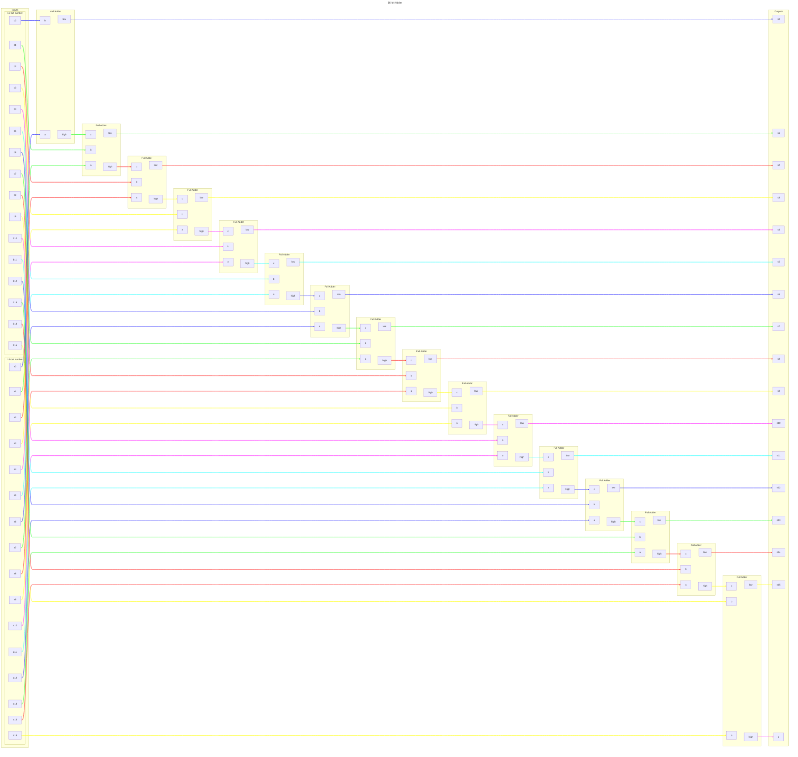

# 16-bit Adder

## Logic

<!-- 8,589,934,592 permutations of the inputs...  NOPE! -->

Given the high number of permutations for this logic table (2³³), I have not
generated it. It follows the same logic as the 4 & 5-bit adders but with a _lot_
more digits!

I am not certain that this is the optimal solution for a 16-bit adder; it uses
140 NAND gates (9 per full-adder, 5 for the half-adder). It should be noted that
the nandgame website appears to use a full-adder, as opposed to a half-adder, in
their provided 16-bit adder which means an output is wasted. This configuration
would increase the NAND gates used to 144.

## Usage

Adds two 16-bit numbers and a 1-bit carry.

The output of this has a maximum decimal value of 131,071 (2³³ × 2 - 2 + 1).
The minus 2 accounts for numbers starting at 0.

16-bit numbers are often represented using hexadecimal nibbles. 65535 is
represented as `ffff` (Remember, we start at 0!). `ffff` plus `ffff` equals
`1fffe`. Add the carry bit to get a maximum hex value output of `1ffff`. Note
that the carry bit does, as always, just add 1 to the next position.

---

