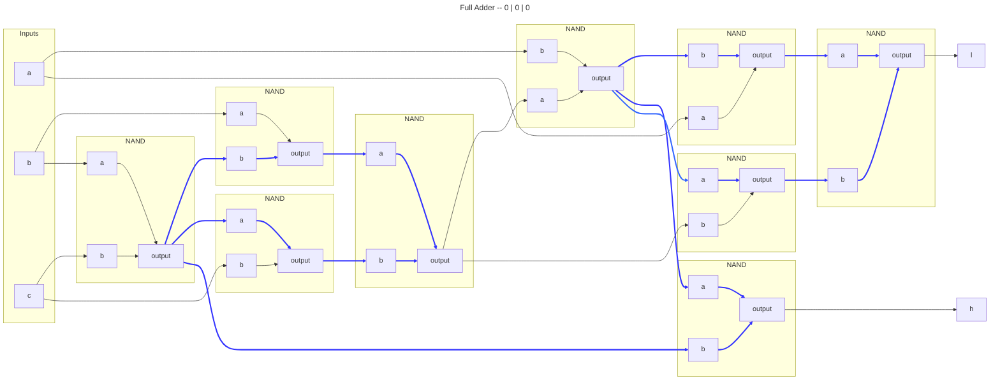
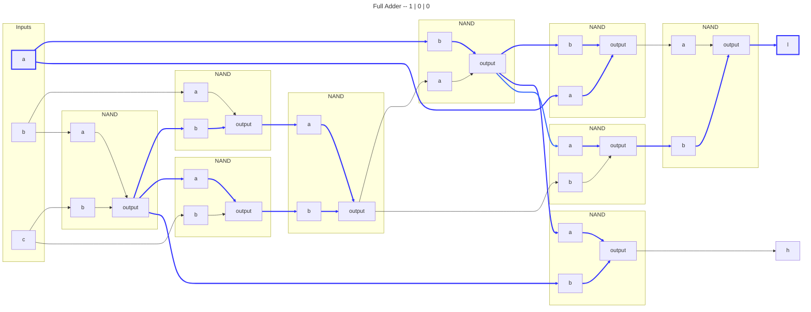
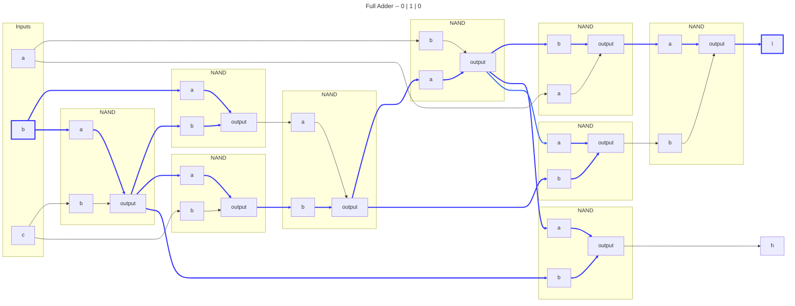
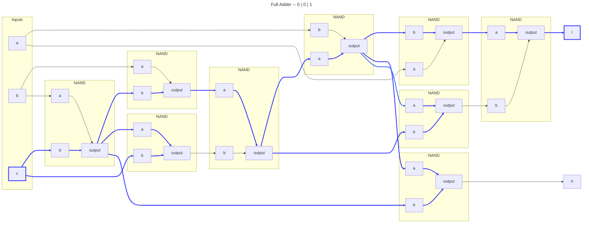
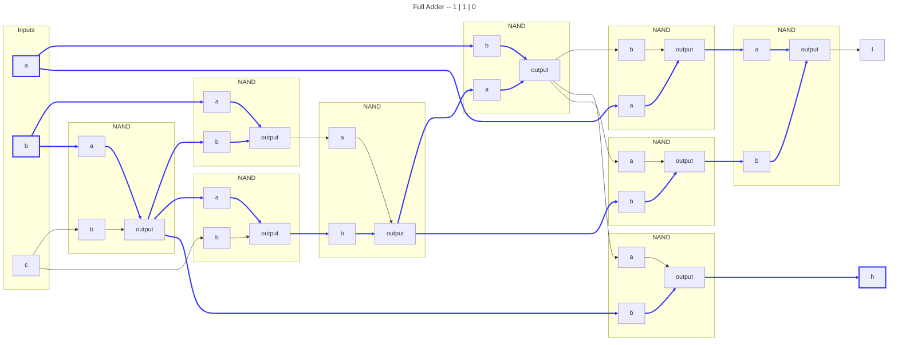
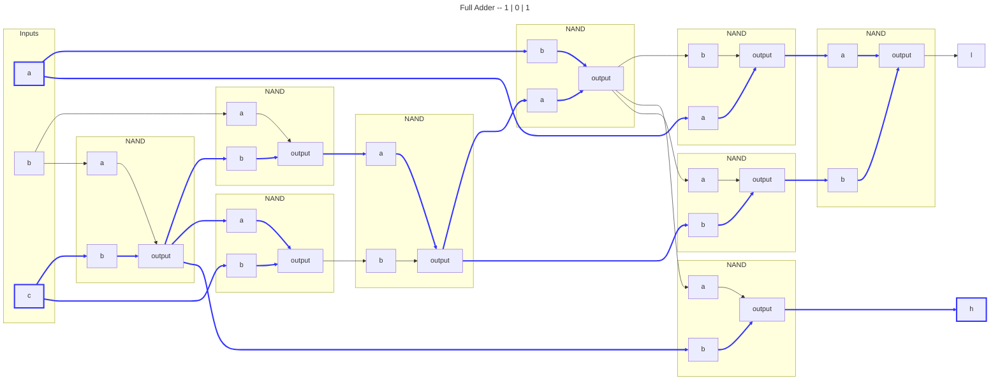
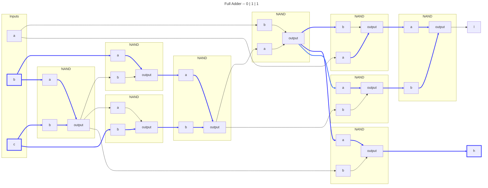
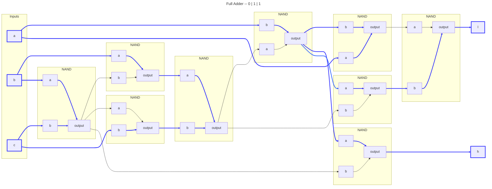
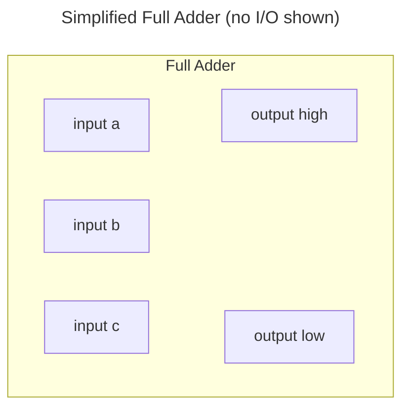

# Full Adder

## Logic

|Input A|Input B|Input C|Output H|Output L|
|:-----:|:-----:|:-----:|:------:|:------:|
|      0|      0|      0|       0|       0|
|      1|      0|      0|       0|       1|
|      0|      1|      0|       0|       1|
|      0|      0|      1|       0|       1|
|      1|      1|      0|       1|       0|
|      1|      0|      1|       1|       0|
|      0|      1|      1|       1|       0|
|      1|      1|      1|       1|       1|

## Usage

Adds two bits.

- Output H is high if at least two inputs are high.
- Output L is high if one or all inputs are high.

---

---

