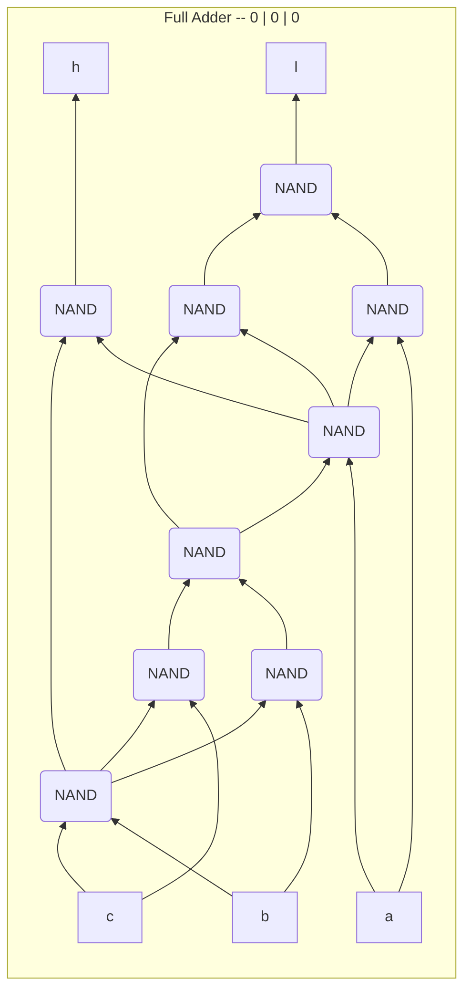
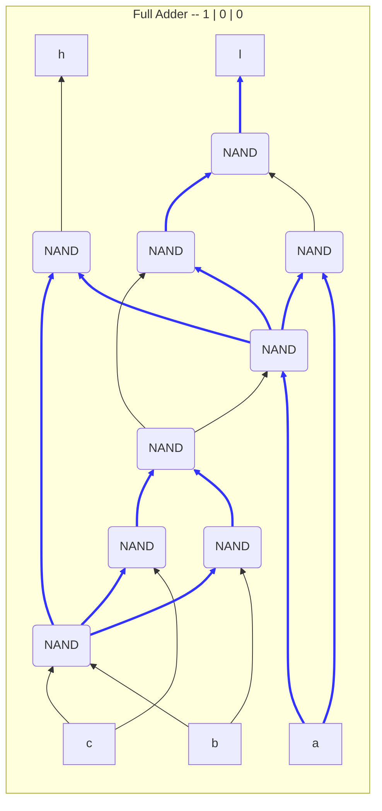
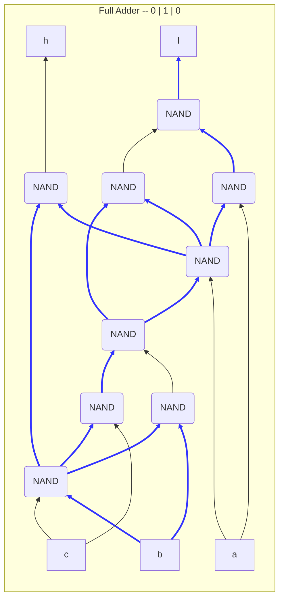
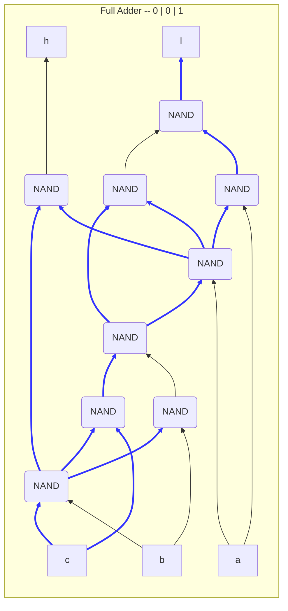
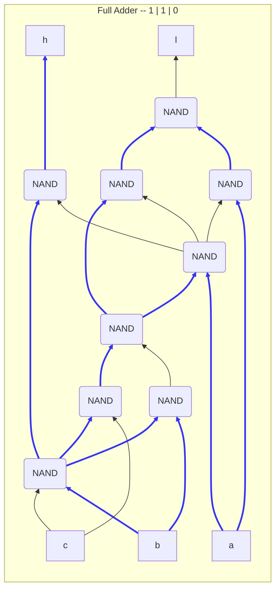
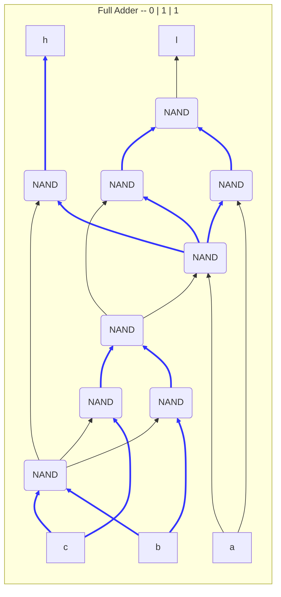
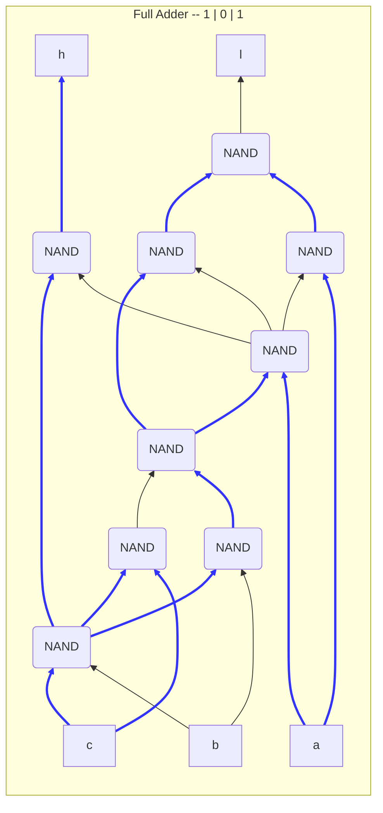
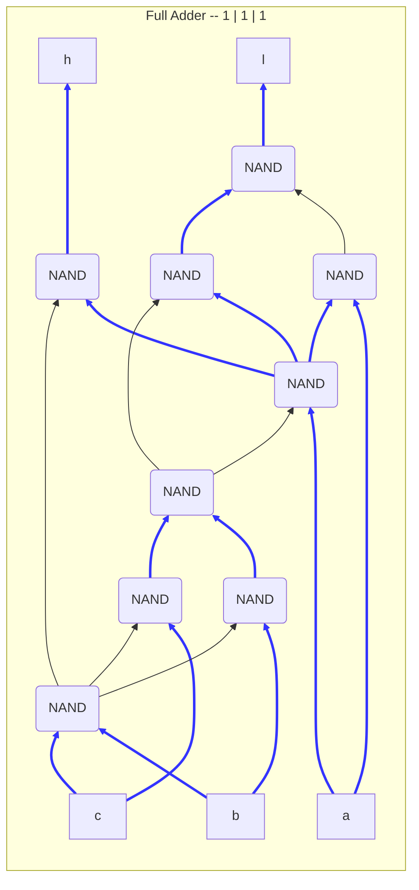

```mermaid
flowchart BT
subgraph "Full Adder -- 0 | 0 | 0"
direction BT

a[a]----->n1(NAND) & n2(NAND);
b[b]-->n3(NAND) & n4(NAND);
c[c]-->n4 & n5(NAND);
n1-->n2 & n6(NAND) & n8(NAND);
n2-->n9(NAND);
n3-->n7(NAND);
n4-->n3 & n6 & n5;
n5-->n7;
n6--->h[h];
n7-->n8 & n1;
n8-->n9;
n9-->l[l];
end
```

```mermaid
flowchart BT
subgraph "Full Adder -- 1 | 0 | 0"
direction BT

a[a]----->n1(NAND) & n2(NAND);
b[b]-->n3(NAND) & n4(NAND);
c[c]-->n4 & n5(NAND);
n1-->n2 & n6(NAND) & n8(NAND);
n2-->n9(NAND);
n3-->n7(NAND);
n4-->n3 & n6 & n5;
n5-->n7;
n6--->h[h];
n7-->n8 & n1;
n8-->n9;
n9-->l[l];
linkStyle 0 stroke:#33f,stroke-width:3px;
linkStyle 1 stroke:#33f,stroke-width:3px;
linkStyle 6 stroke:#33f,stroke-width:3px;
linkStyle 7 stroke:#33f,stroke-width:3px;
linkStyle 8 stroke:#33f,stroke-width:3px;
linkStyle 11 stroke:#33f,stroke-width:3px;
linkStyle 12 stroke:#33f,stroke-width:3px;
linkStyle 13 stroke:#33f,stroke-width:3px;
linkStyle 14 stroke:#33f,stroke-width:3px;
linkStyle 10 stroke:#33f,stroke-width:3px;
linkStyle 18 stroke:#33f,stroke-width:3px;
linkStyle 19 stroke:#33f,stroke-width:3px;
end
```

```mermaid
flowchart BT
subgraph "Full Adder -- 0 | 1 | 0"
direction BT

a[a]----->n1(NAND) & n2(NAND);
b[b]-->n3(NAND) & n4(NAND);
c[c]-->n4 & n5(NAND);
n1-->n2 & n6(NAND) & n8(NAND);
n2-->n9(NAND);
n3-->n7(NAND);
n4-->n3 & n6 & n5;
n5-->n7;
n6--->h[h];
n7-->n8 & n1;
n8-->n9;
n9-->l[l];
linkStyle 2 stroke:#33f,stroke-width:3px;
linkStyle 3 stroke:#33f,stroke-width:3px;
linkStyle 6 stroke:#33f,stroke-width:3px;
linkStyle 7 stroke:#33f,stroke-width:3px;
linkStyle 8 stroke:#33f,stroke-width:3px;
linkStyle 9 stroke:#33f,stroke-width:3px;
linkStyle 11 stroke:#33f,stroke-width:3px;
linkStyle 12 stroke:#33f,stroke-width:3px;
linkStyle 13 stroke:#33f,stroke-width:3px;
linkStyle 14 stroke:#33f,stroke-width:3px;
linkStyle 16 stroke:#33f,stroke-width:3px;
linkStyle 17 stroke:#33f,stroke-width:3px;
linkStyle 19 stroke:#33f,stroke-width:3px;
end
```

```mermaid
flowchart BT
subgraph "Full Adder -- 0 | 0 | 1"
direction BT

a[a]----->n1(NAND) & n2(NAND);
b[b]-->n3(NAND) & n4(NAND);
c[c]-->n4 & n5(NAND);
n1-->n2 & n6(NAND) & n8(NAND);
n2-->n9(NAND);
n3-->n7(NAND);
n4-->n3 & n6 & n5;
n5-->n7;
n6--->h[h];
n7-->n8 & n1;
n8-->n9;
n9-->l[l];
linkStyle 4 stroke:#33f,stroke-width:3px;
linkStyle 5 stroke:#33f,stroke-width:3px;
linkStyle 6 stroke:#33f,stroke-width:3px;
linkStyle 7 stroke:#33f,stroke-width:3px;
linkStyle 8 stroke:#33f,stroke-width:3px;
linkStyle 9 stroke:#33f,stroke-width:3px;
linkStyle 11 stroke:#33f,stroke-width:3px;
linkStyle 12 stroke:#33f,stroke-width:3px;
linkStyle 13 stroke:#33f,stroke-width:3px;
linkStyle 14 stroke:#33f,stroke-width:3px;
linkStyle 16 stroke:#33f,stroke-width:3px;
linkStyle 17 stroke:#33f,stroke-width:3px;
linkStyle 19 stroke:#33f,stroke-width:3px;
end
```

```mermaid
flowchart BT
subgraph "Full Adder -- 1 | 1 | 0"
direction BT

a[a]----->n1(NAND) & n2(NAND);
b[b]-->n3(NAND) & n4(NAND);
c[c]-->n4 & n5(NAND);
n1-->n2 & n6(NAND) & n8(NAND);
n2-->n9(NAND);
n3-->n7(NAND);
n4-->n3 & n6 & n5;
n5-->n7;
n6--->h[h];
n7-->n8 & n1;
n8-->n9;
n9-->l[l];
linkStyle 0 stroke:#33f,stroke-width:3px;
linkStyle 1 stroke:#33f,stroke-width:3px;
linkStyle 2 stroke:#33f,stroke-width:3px;
linkStyle 3 stroke:#33f,stroke-width:3px;
linkStyle 9 stroke:#33f,stroke-width:3px;
linkStyle 11 stroke:#33f,stroke-width:3px;
linkStyle 12 stroke:#33f,stroke-width:3px;
linkStyle 13 stroke:#33f,stroke-width:3px;
linkStyle 14 stroke:#33f,stroke-width:3px;
linkStyle 15 stroke:#33f,stroke-width:3px;
linkStyle 16 stroke:#33f,stroke-width:3px;
linkStyle 17 stroke:#33f,stroke-width:3px;
linkStyle 18 stroke:#33f,stroke-width:3px;
end
```

```mermaid
flowchart BT
subgraph "Full Adder -- 0 | 1 | 1"
direction BT

a[a]----->n1(NAND) & n2(NAND);
b[b]-->n3(NAND) & n4(NAND);
c[c]-->n4 & n5(NAND);
n1-->n2 & n6(NAND) & n8(NAND);
n2-->n9(NAND);
n3-->n7(NAND);
n4-->n3 & n6 & n5;
n5-->n7;
n6--->h[h];
n7-->n8 & n1;
n8-->n9;
n9-->l[l];
linkStyle 2 stroke:#33f,stroke-width:3px;
linkStyle 3 stroke:#33f,stroke-width:3px;
linkStyle 4 stroke:#33f,stroke-width:3px;
linkStyle 5 stroke:#33f,stroke-width:3px;
linkStyle 6 stroke:#33f,stroke-width:3px;
linkStyle 7 stroke:#33f,stroke-width:3px;
linkStyle 8 stroke:#33f,stroke-width:3px;
linkStyle 9 stroke:#33f,stroke-width:3px;
linkStyle 10 stroke:#33f,stroke-width:3px;
linkStyle 14 stroke:#33f,stroke-width:3px;
linkStyle 15 stroke:#33f,stroke-width:3px;
linkStyle 18 stroke:#33f,stroke-width:3px;
end
```

```mermaid
flowchart BT
subgraph "Full Adder -- 1 | 0 | 1"
direction BT

a[a]----->n1(NAND) & n2(NAND);
b[b]-->n3(NAND) & n4(NAND);
c[c]-->n4 & n5(NAND);
n1-->n2 & n6(NAND) & n8(NAND);
n2-->n9(NAND);
n3-->n7(NAND);
n4-->n3 & n6 & n5;
n5-->n7;
n6--->h[h];
n7-->n8 & n1;
n8-->n9;
n9-->l[l];
linkStyle 0 stroke:#33f,stroke-width:3px;
linkStyle 1 stroke:#33f,stroke-width:3px;
linkStyle 4 stroke:#33f,stroke-width:3px;
linkStyle 5 stroke:#33f,stroke-width:3px;
linkStyle 9 stroke:#33f,stroke-width:3px;
linkStyle 10 stroke:#33f,stroke-width:3px;
linkStyle 11 stroke:#33f,stroke-width:3px;
linkStyle 12 stroke:#33f,stroke-width:3px;
linkStyle 13 stroke:#33f,stroke-width:3px;
linkStyle 15 stroke:#33f,stroke-width:3px;
linkStyle 16 stroke:#33f,stroke-width:3px;
linkStyle 17 stroke:#33f,stroke-width:3px;
linkStyle 18 stroke:#33f,stroke-width:3px;
end
```

```mermaid
flowchart BT
subgraph "Full Adder -- 1 | 1 | 1"
direction BT

a[a]----->n1(NAND) & n2(NAND);
b[b]-->n3(NAND) & n4(NAND);
c[c]-->n4 & n5(NAND);
n1-->n2 & n6(NAND) & n8(NAND);
n2-->n9(NAND);
n3-->n7(NAND);
n4-->n3 & n6 & n5;
n5-->n7;
n6--->h[h];
n7-->n8 & n1;
n8-->n9;
n9-->l[l];
linkStyle 0 stroke:#33f,stroke-width:3px;
linkStyle 1 stroke:#33f,stroke-width:3px;
linkStyle 2 stroke:#33f,stroke-width:3px;
linkStyle 3 stroke:#33f,stroke-width:3px;
linkStyle 4 stroke:#33f,stroke-width:3px;
linkStyle 5 stroke:#33f,stroke-width:3px;
linkStyle 6 stroke:#33f,stroke-width:3px;
linkStyle 7 stroke:#33f,stroke-width:3px;
linkStyle 8 stroke:#33f,stroke-width:3px;
linkStyle 10 stroke:#33f,stroke-width:3px;
linkStyle 14 stroke:#33f,stroke-width:3px;
linkStyle 15 stroke:#33f,stroke-width:3px;
linkStyle 18 stroke:#33f,stroke-width:3px;
linkStyle 19 stroke:#33f,stroke-width:3px;
end
```
