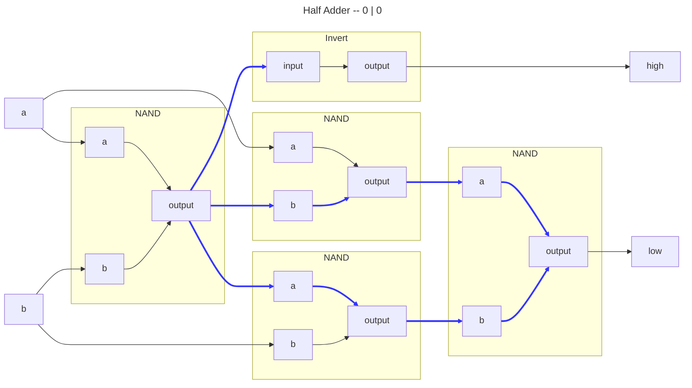
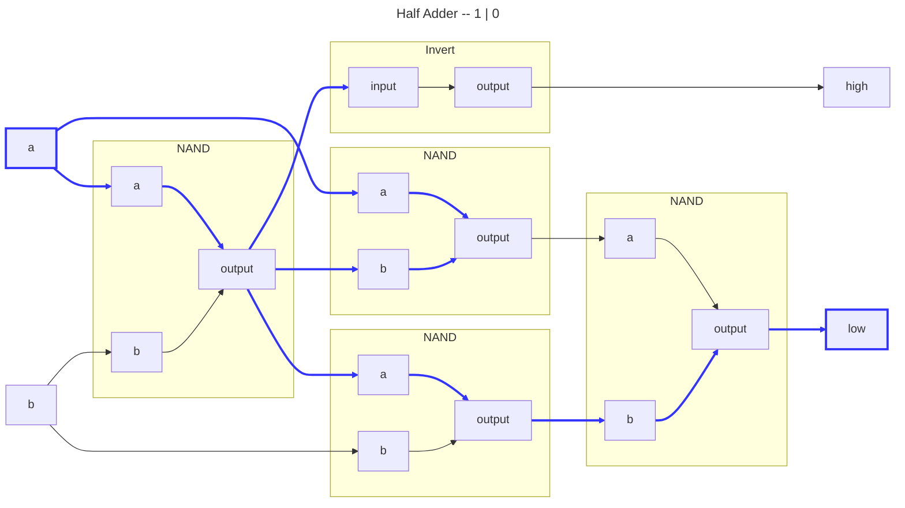
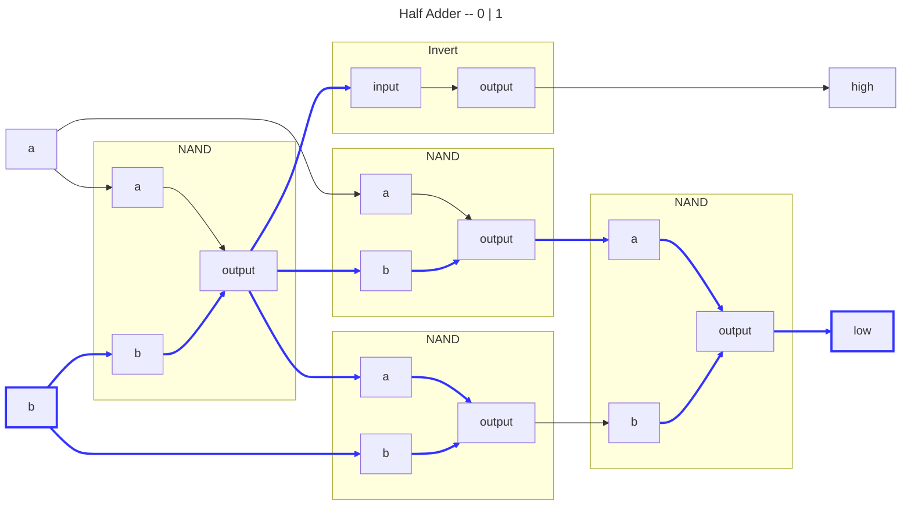
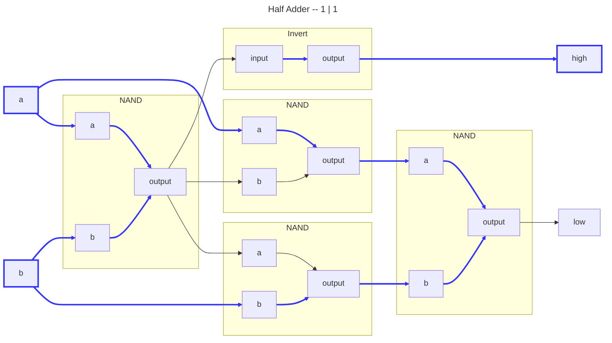
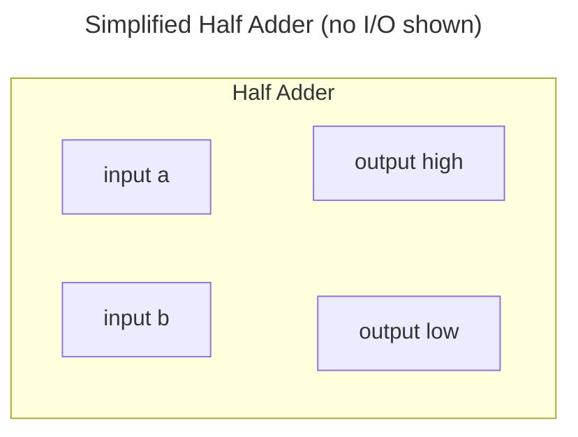

# Half Adder

## Logic

|Input A|Input B|Output H|Output L|
|:-----:|:-----:|:------:|:------:|
|      0|      0|       0|       0|
|      1|      0|       0|       1|
|      0|      1|       0|       1|
|      1|      1|       1|       0|

## Usage

Adds two bits.

- Output H is high if both inputs are high.
- Output L is high if only one input is high.

---

---

