# Multi-bit Adder

## Logic

|Input A1|Input A0|Input B1|Input B0|Input C|Output C|Output S1|Output S2|
|:------:|:------:|:------:|:------:|:-----:|:------:|:-------:|:-------:|
|       0|       0|       0|       0|      0|       0|        0|        0|
|       1|       1|       1|       1|      0|       0|        0|        1|
|       0|       0|       0|       0|      1|       0|        0|        1|
|       0|       0|       0|       0|      0|       1|        0|        1|
|       1|       1|       1|       1|      1|       0|        1|        0|
|       1|       1|       1|       1|      0|       1|        1|        0|
|       0|       0|       0|       0|      1|       1|        1|        0|
|       1|       1|       1|       1|      1|       1|        1|        1|

## Usage

Adds two 2-bit numbers and a 1-bit carry.

Multiple multi-bit adders can be combined to create a 16-bit adder, or "add 16".

---

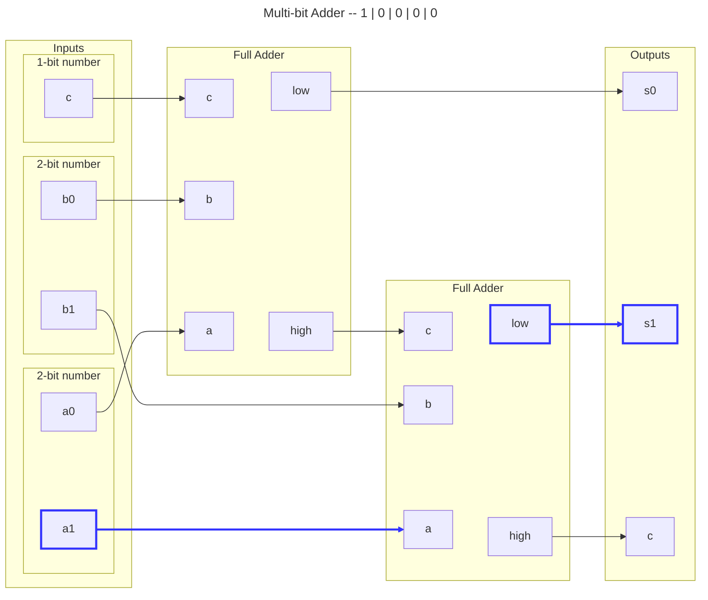
```mermaid
---
title: Multi-bit Adder -- 1 | 0 | 0 | 0 | 0
---
flowchart LR;

subgraph fa1 [Full Adder];
  direction LR;
  fa1ina[a] & fa1inb[b] & fa1inc[c] ~~~ fa1oh[high] & fa1ol[low];
end;

subgraph fa2 [Full Adder];
  direction LR;
  fa2ina[a] & fa2inb[b] & fa2inc[c] ~~~ fa2oh[high] & fa2ol[low];
end;

subgraph inputs [Inputs];
  direction TB;
  subgraph a# [2-bit number];
    a1[a1];
    a0[a0];
  end
  subgraph b# [2-bit number];
    b1[b1];
    b0[b0];
  end
  subgraph c# [1-bit number];
    c[c];
  end
end;

subgraph outputs [Outputs];
  direction TB;
  s0[s0];
  s1[s1]:::ON;
  co[c];
end;

fa2ol:::ON;
a0 --> fa1ina;
b0 --> fa1inb;
c --> fa1inc;
a1:::ON --> fa2ina;
b1 --> fa2inb;
fa1oh --> fa2inc;
fa1ol ----> s0;
fa2ol --> s1;
fa2oh --> co[c];
classDef ON stroke:#33f,stroke-width:3px;
linkStyle 15 stroke:#33f,stroke-width:3px;
linkStyle 19 stroke:#33f,stroke-width:3px;
```

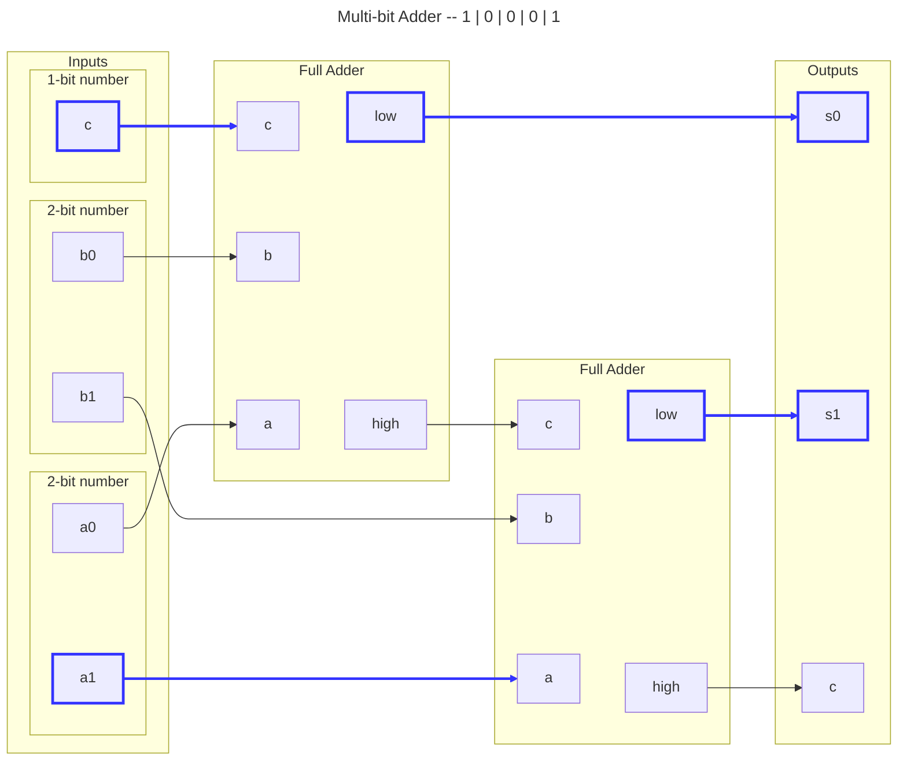
```mermaid
---
title: Multi-bit Adder -- 1 | 0 | 0 | 0 | 1
---
flowchart LR;

subgraph fa1 [Full Adder];
  direction LR;
  fa1ina[a] & fa1inb[b] & fa1inc[c] ~~~ fa1oh[high] & fa1ol[low];
end;

subgraph fa2 [Full Adder];
  direction LR;
  fa2ina[a] & fa2inb[b] & fa2inc[c] ~~~ fa2oh[high] & fa2ol[low];
end;

subgraph inputs [Inputs];
  direction TB;
  subgraph a# [2-bit number];
    a1[a1];
    a0[a0];
  end
  subgraph b# [2-bit number];
    b1[b1];
    b0[b0];
  end
  subgraph c# [1-bit number];
    c[c];
  end
end;

subgraph outputs [Outputs];
  direction TB;
  s0[s0]:::ON;
  s1[s1]:::ON;
  co[c];
end;

fa1ol:::ON;
fa2ol:::ON;
a0 --> fa1ina;
b0 --> fa1inb;
c:::ON --> fa1inc;
a1:::ON --> fa2ina;
b1 --> fa2inb;
fa1oh --> fa2inc;
fa1ol ----> s0;
fa2ol --> s1;
fa2oh --> co[c];
classDef ON stroke:#33f,stroke-width:3px;
linkStyle 14 stroke:#33f,stroke-width:3px;
linkStyle 15 stroke:#33f,stroke-width:3px;
linkStyle 18 stroke:#33f,stroke-width:3px;
linkStyle 19 stroke:#33f,stroke-width:3px;
```

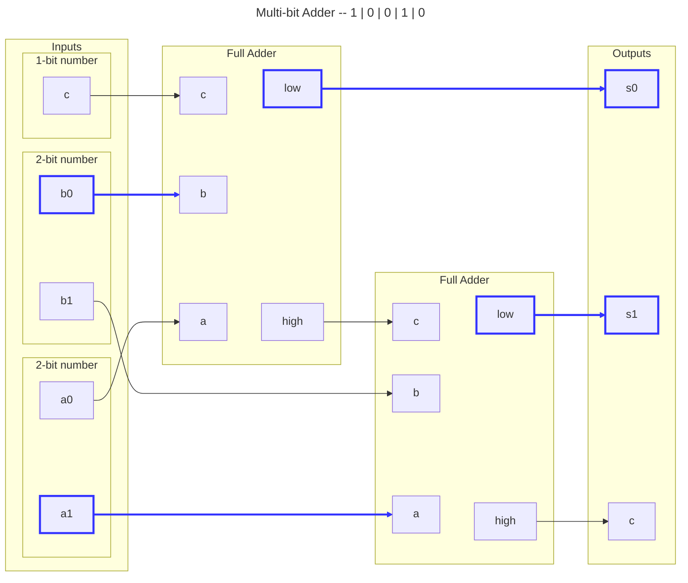
```mermaid
---
title: Multi-bit Adder -- 1 | 0 | 0 | 1 | 0
---
flowchart LR;

subgraph fa1 [Full Adder];
  direction LR;
  fa1ina[a] & fa1inb[b] & fa1inc[c] ~~~ fa1oh[high] & fa1ol[low];
end;

subgraph fa2 [Full Adder];
  direction LR;
  fa2ina[a] & fa2inb[b] & fa2inc[c] ~~~ fa2oh[high] & fa2ol[low];
end;

subgraph inputs [Inputs];
  direction TB;
  subgraph a# [2-bit number];
    a1[a1];
    a0[a0];
  end
  subgraph b# [2-bit number];
    b1[b1];
    b0[b0];
  end
  subgraph c# [1-bit number];
    c[c];
  end
end;

subgraph outputs [Outputs];
  direction TB;
  s0[s0]:::ON;
  s1[s1]:::ON;
  co[c];
end;

fa1ol:::ON;
fa2ol:::ON;
a0 --> fa1ina;
b0:::ON --> fa1inb;
c --> fa1inc;
a1:::ON --> fa2ina;
b1 --> fa2inb;
fa1oh --> fa2inc;
fa1ol ----> s0;
fa2ol --> s1;
fa2oh --> co[c];
classDef ON stroke:#33f,stroke-width:3px;
linkStyle 13 stroke:#33f,stroke-width:3px;
linkStyle 15 stroke:#33f,stroke-width:3px;
linkStyle 18 stroke:#33f,stroke-width:3px;
linkStyle 19 stroke:#33f,stroke-width:3px;
```

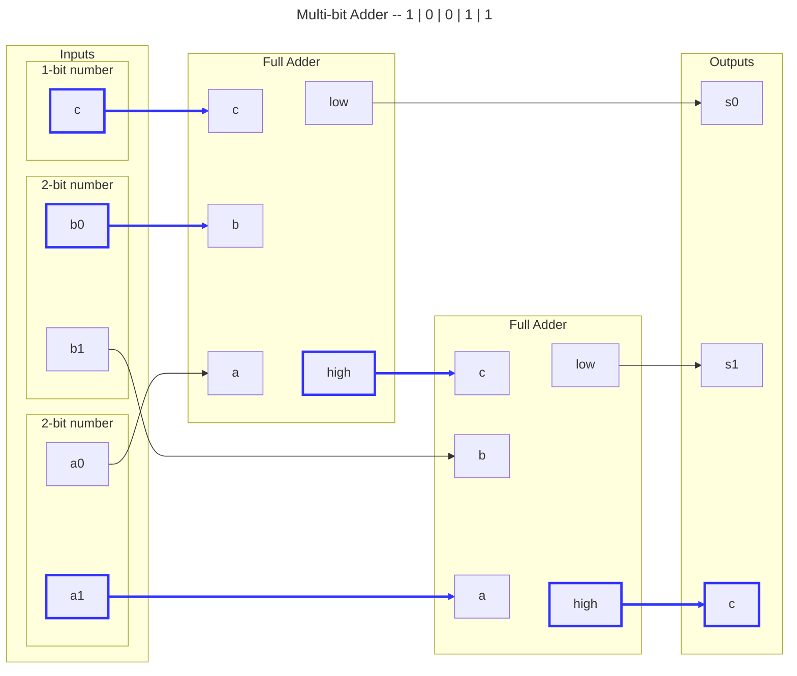
```mermaid
---
title: Multi-bit Adder -- 1 | 0 | 0 | 1 | 1
---
flowchart LR;

subgraph fa1 [Full Adder];
  direction LR;
  fa1ina[a] & fa1inb[b] & fa1inc[c] ~~~ fa1oh[high] & fa1ol[low];
end;

subgraph fa2 [Full Adder];
  direction LR;
  fa2ina[a] & fa2inb[b] & fa2inc[c] ~~~ fa2oh[high] & fa2ol[low];
end;

subgraph inputs [Inputs];
  direction TB;
  subgraph a# [2-bit number];
    a1[a1];
    a0[a0];
  end
  subgraph b# [2-bit number];
    b1[b1];
    b0[b0];
  end
  subgraph c# [1-bit number];
    c[c];
  end
end;

subgraph outputs [Outputs];
  direction TB;
  s0[s0];
  s1[s1];
  co[c]:::ON;
end;

fa1oh:::ON;
fa2oh:::ON;
a0 --> fa1ina;
b0:::ON --> fa1inb;
c:::ON --> fa1inc;
a1:::ON --> fa2ina;
b1 --> fa2inb;
fa1oh --> fa2inc;
fa1ol ----> s0;
fa2ol --> s1;
fa2oh --> co[c];
classDef ON stroke:#33f,stroke-width:3px;
linkStyle 13 stroke:#33f,stroke-width:3px;
linkStyle 14 stroke:#33f,stroke-width:3px;
linkStyle 15 stroke:#33f,stroke-width:3px;
linkStyle 17 stroke:#33f,stroke-width:3px;
linkStyle 20 stroke:#33f,stroke-width:3px;
```

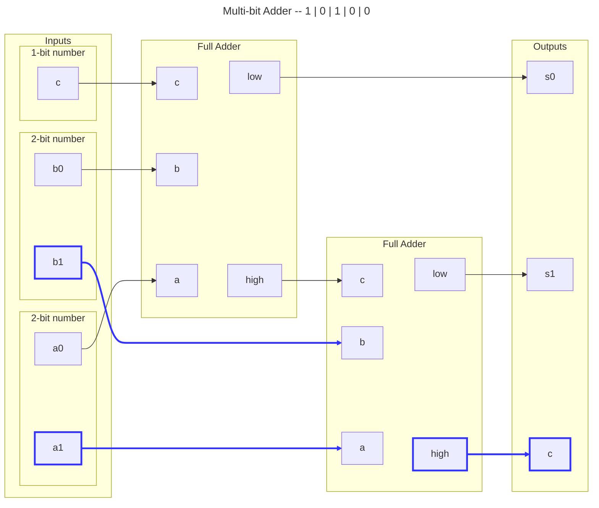
```mermaid
---
title: Multi-bit Adder -- 1 | 0 | 1 | 0 | 0
---
flowchart LR;

subgraph fa1 [Full Adder];
  direction LR;
  fa1ina[a] & fa1inb[b] & fa1inc[c] ~~~ fa1oh[high] & fa1ol[low];
end;

subgraph fa2 [Full Adder];
  direction LR;
  fa2ina[a] & fa2inb[b] & fa2inc[c] ~~~ fa2oh[high] & fa2ol[low];
end;

subgraph inputs [Inputs];
  direction TB;
  subgraph a# [2-bit number];
    a1[a1];
    a0[a0];
  end
  subgraph b# [2-bit number];
    b1[b1];
    b0[b0];
  end
  subgraph c# [1-bit number];
    c[c];
  end
end;

subgraph outputs [Outputs];
  direction TB;
  s0[s0];
  s1[s1];
  co[c]:::ON;
end;

fa2oh:::ON;
a0 --> fa1ina;
b0 --> fa1inb;
c --> fa1inc;
a1:::ON --> fa2ina;
b1:::ON --> fa2inb;
fa1oh --> fa2inc;
fa1ol ----> s0;
fa2ol --> s1;
fa2oh --> co[c];
classDef ON stroke:#33f,stroke-width:3px;
linkStyle 15 stroke:#33f,stroke-width:3px;
linkStyle 16 stroke:#33f,stroke-width:3px;
linkStyle 20 stroke:#33f,stroke-width:3px;
```

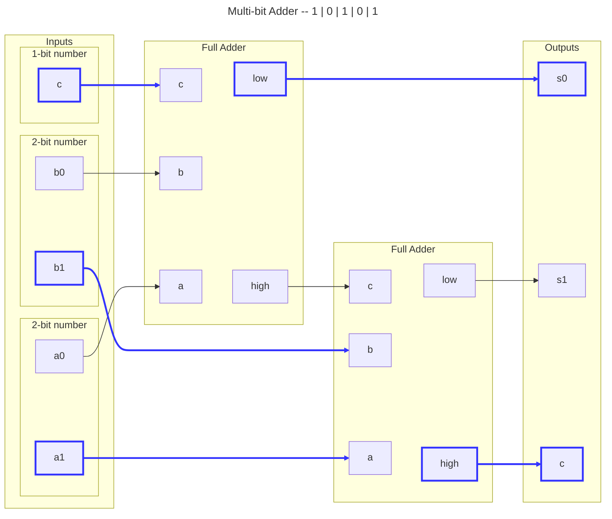
```mermaid
---
title: Multi-bit Adder -- 1 | 0 | 1 | 0 | 1
---
flowchart LR;

subgraph fa1 [Full Adder];
  direction LR;
  fa1ina[a] & fa1inb[b] & fa1inc[c] ~~~ fa1oh[high] & fa1ol[low];
end;

subgraph fa2 [Full Adder];
  direction LR;
  fa2ina[a] & fa2inb[b] & fa2inc[c] ~~~ fa2oh[high] & fa2ol[low];
end;

subgraph inputs [Inputs];
  direction TB;
  subgraph a# [2-bit number];
    a1[a1];
    a0[a0];
  end
  subgraph b# [2-bit number];
    b1[b1];
    b0[b0];
  end
  subgraph c# [1-bit number];
    c[c];
  end
end;

subgraph outputs [Outputs];
  direction TB;
  s0[s0]:::ON;
  s1[s1];
  co[c]:::ON;
end;

fa1ol:::ON;
fa2oh:::ON;
a0 --> fa1ina;
b0 --> fa1inb;
c:::ON --> fa1inc;
a1:::ON --> fa2ina;
b1:::ON --> fa2inb;
fa1oh --> fa2inc;
fa1ol ----> s0;
fa2ol --> s1;
fa2oh --> co[c];
classDef ON stroke:#33f,stroke-width:3px;
linkStyle 14 stroke:#33f,stroke-width:3px;
linkStyle 15 stroke:#33f,stroke-width:3px;
linkStyle 16 stroke:#33f,stroke-width:3px;
linkStyle 18 stroke:#33f,stroke-width:3px;
linkStyle 20 stroke:#33f,stroke-width:3px;
```

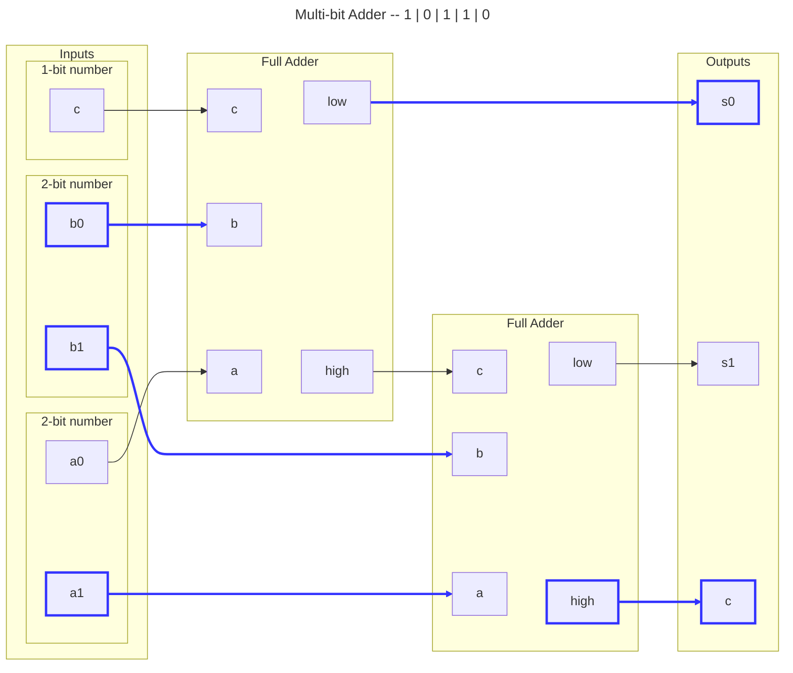
```mermaid
---
title: Multi-bit Adder -- 1 | 0 | 1 | 1 | 0
---
flowchart LR;

subgraph fa1 [Full Adder];
  direction LR;
  fa1ina[a] & fa1inb[b] & fa1inc[c] ~~~ fa1oh[high] & fa1ol[low];
end;

subgraph fa2 [Full Adder];
  direction LR;
  fa2ina[a] & fa2inb[b] & fa2inc[c] ~~~ fa2oh[high] & fa2ol[low];
end;

subgraph inputs [Inputs];
  direction TB;
  subgraph a# [2-bit number];
    a1[a1];
    a0[a0];
  end
  subgraph b# [2-bit number];
    b1[b1];
    b0[b0];
  end
  subgraph c# [1-bit number];
    c[c];
  end
end;

subgraph outputs [Outputs];
  direction TB;
  s0[s0]:::ON;
  s1[s1];
  co[c]:::ON;
end;

fa2oh:::ON;
a0 --> fa1ina;
b0:::ON --> fa1inb;
c --> fa1inc;
a1:::ON --> fa2ina;
b1:::ON --> fa2inb;
fa1oh --> fa2inc;
fa1ol ----> s0;
fa2ol --> s1;
fa2oh --> co[c];
classDef ON stroke:#33f,stroke-width:3px;
linkStyle 13 stroke:#33f,stroke-width:3px;
linkStyle 15 stroke:#33f,stroke-width:3px;
linkStyle 16 stroke:#33f,stroke-width:3px;
linkStyle 18 stroke:#33f,stroke-width:3px;
linkStyle 20 stroke:#33f,stroke-width:3px;
```

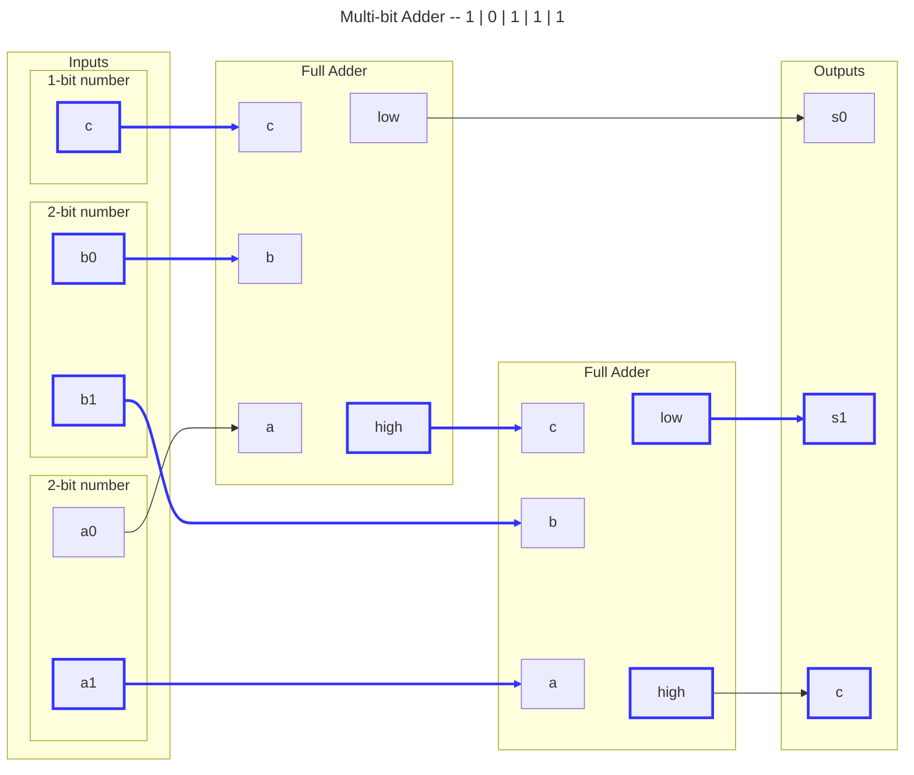
```mermaid
---
title: Multi-bit Adder -- 1 | 0 | 1 | 1 | 1
---
flowchart LR;

subgraph fa1 [Full Adder];
  direction LR;
  fa1ina[a] & fa1inb[b] & fa1inc[c] ~~~ fa1oh[high] & fa1ol[low];
end;

subgraph fa2 [Full Adder];
  direction LR;
  fa2ina[a] & fa2inb[b] & fa2inc[c] ~~~ fa2oh[high] & fa2ol[low];
end;

subgraph inputs [Inputs];
  direction TB;
  subgraph a# [2-bit number];
    a1[a1];
    a0[a0];
  end
  subgraph b# [2-bit number];
    b1[b1];
    b0[b0];
  end
  subgraph c# [1-bit number];
    c[c];
  end
end;

subgraph outputs [Outputs];
  direction TB;
  s0[s0];
  s1[s1]:::ON;
  co[c]:::ON;
end;

fa1oh:::ON;
fa2ol:::ON;
fa2oh:::ON;
a0 --> fa1ina;
b0:::ON --> fa1inb;
c:::ON --> fa1inc;
a1:::ON --> fa2ina;
b1:::ON --> fa2inb;
fa1oh --> fa2inc;
fa1ol ----> s0;
fa2ol --> s1;
fa2oh --> co[c];
classDef ON stroke:#33f,stroke-width:3px;
linkStyle 13 stroke:#33f,stroke-width:3px;
linkStyle 14 stroke:#33f,stroke-width:3px;
linkStyle 15 stroke:#33f,stroke-width:3px;
linkStyle 16 stroke:#33f,stroke-width:3px;
linkStyle 17 stroke:#33f,stroke-width:3px;
linkStyle 19 stroke:#33f,stroke-width:3px;
```

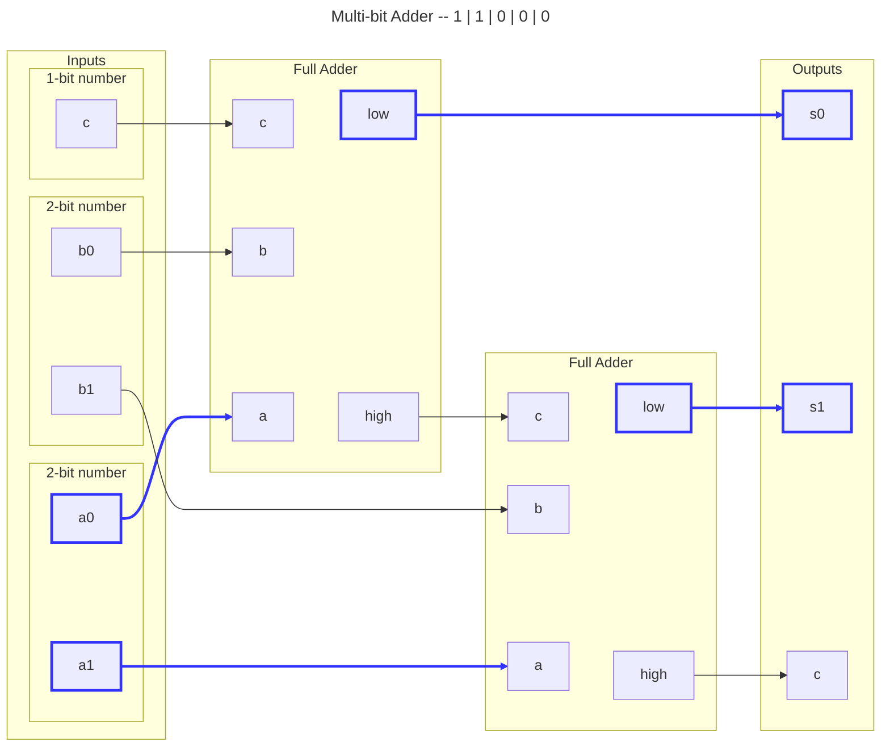
```mermaid
---
title: Multi-bit Adder -- 1 | 1 | 0 | 0 | 0
---
flowchart LR;

subgraph fa1 [Full Adder];
  direction LR;
  fa1ina[a] & fa1inb[b] & fa1inc[c] ~~~ fa1oh[high] & fa1ol[low];
end;

subgraph fa2 [Full Adder];
  direction LR;
  fa2ina[a] & fa2inb[b] & fa2inc[c] ~~~ fa2oh[high] & fa2ol[low];
end;

subgraph inputs [Inputs];
  direction TB;
  subgraph a# [2-bit number];
    a1[a1];
    a0[a0];
  end
  subgraph b# [2-bit number];
    b1[b1];
    b0[b0];
  end
  subgraph c# [1-bit number];
    c[c];
  end
end;

subgraph outputs [Outputs];
  direction TB;
  s0[s0]:::ON;
  s1[s1]:::ON;
  co[c];
end;

fa1ol:::ON;
fa2ol:::ON;
a0:::ON --> fa1ina;
b0 --> fa1inb;
c --> fa1inc;
a1:::ON --> fa2ina;
b1 --> fa2inb;
fa1oh --> fa2inc;
fa1ol ----> s0;
fa2ol --> s1;
fa2oh --> co[c];
classDef ON stroke:#33f,stroke-width:3px;
linkStyle 12 stroke:#33f,stroke-width:3px;
linkStyle 15 stroke:#33f,stroke-width:3px;
linkStyle 18 stroke:#33f,stroke-width:3px;
linkStyle 19 stroke:#33f,stroke-width:3px;
```

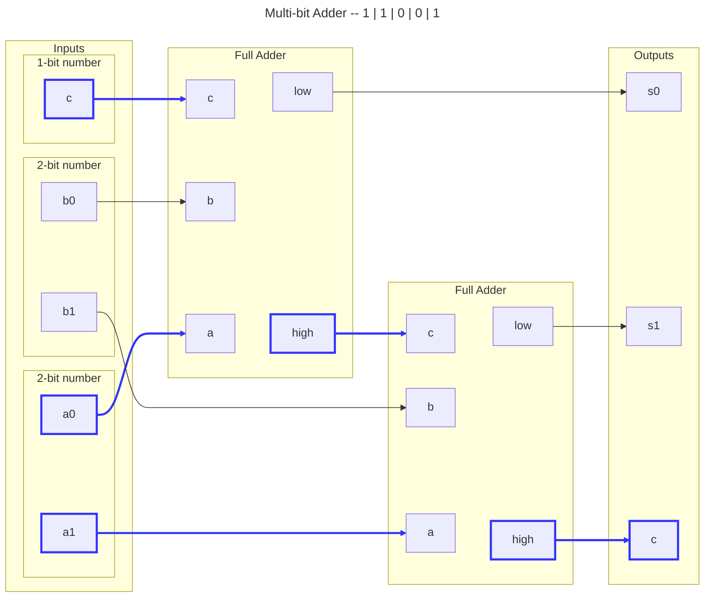
```mermaid
---
title: Multi-bit Adder -- 1 | 1 | 0 | 0 | 1
---
flowchart LR;

subgraph fa1 [Full Adder];
  direction LR;
  fa1ina[a] & fa1inb[b] & fa1inc[c] ~~~ fa1oh[high] & fa1ol[low];
end;

subgraph fa2 [Full Adder];
  direction LR;
  fa2ina[a] & fa2inb[b] & fa2inc[c] ~~~ fa2oh[high] & fa2ol[low];
end;

subgraph inputs [Inputs];
  direction TB;
  subgraph a# [2-bit number];
    a1[a1];
    a0[a0];
  end
  subgraph b# [2-bit number];
    b1[b1];
    b0[b0];
  end
  subgraph c# [1-bit number];
    c[c];
  end
end;

subgraph outputs [Outputs];
  direction TB;
  s0[s0];
  s1[s1];
  co[c]:::ON;
end;

fa1oh:::ON;
fa2oh:::ON;
a0:::ON --> fa1ina;
b0 --> fa1inb;
c:::ON --> fa1inc;
a1:::ON --> fa2ina;
b1 --> fa2inb;
fa1oh --> fa2inc;
fa1ol ----> s0;
fa2ol --> s1;
fa2oh --> co[c];
classDef ON stroke:#33f,stroke-width:3px;
linkStyle 12 stroke:#33f,stroke-width:3px;
linkStyle 14 stroke:#33f,stroke-width:3px;
linkStyle 15 stroke:#33f,stroke-width:3px;
linkStyle 17 stroke:#33f,stroke-width:3px;
linkStyle 20 stroke:#33f,stroke-width:3px;
```

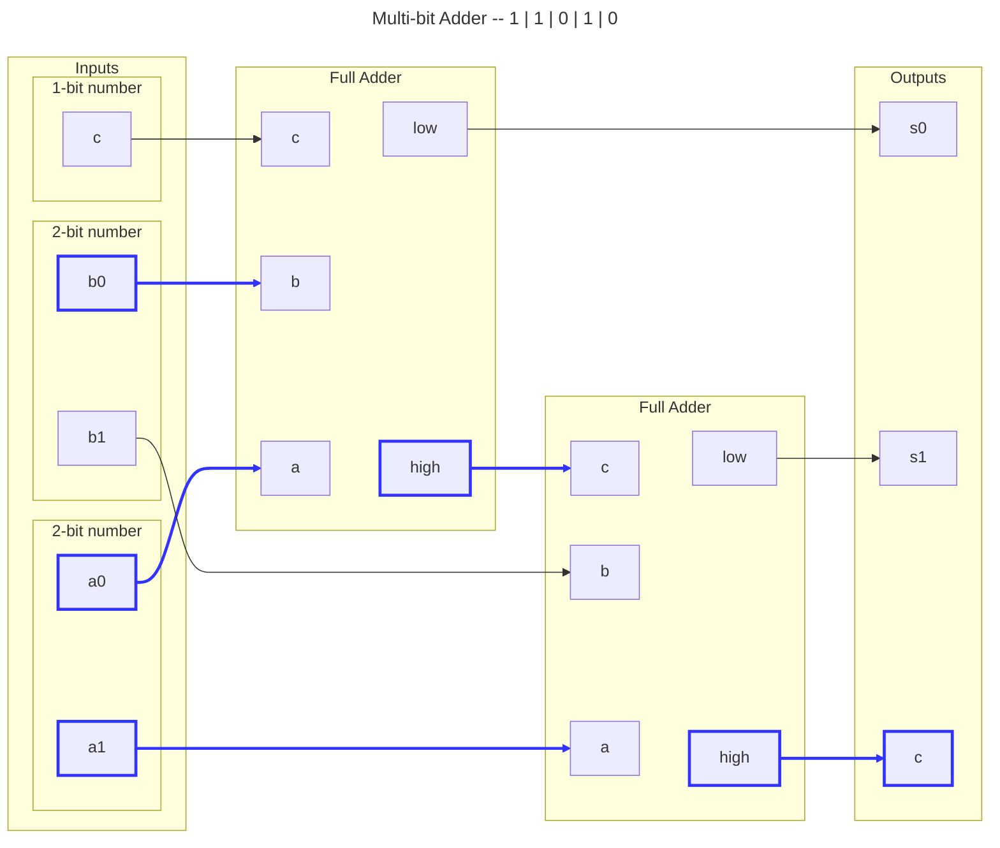
```mermaid
---
title: Multi-bit Adder -- 1 | 1 | 0 | 1 | 0
---
flowchart LR;

subgraph fa1 [Full Adder];
  direction LR;
  fa1ina[a] & fa1inb[b] & fa1inc[c] ~~~ fa1oh[high] & fa1ol[low];
end;

subgraph fa2 [Full Adder];
  direction LR;
  fa2ina[a] & fa2inb[b] & fa2inc[c] ~~~ fa2oh[high] & fa2ol[low];
end;

subgraph inputs [Inputs];
  direction TB;
  subgraph a# [2-bit number];
    a1[a1];
    a0[a0];
  end
  subgraph b# [2-bit number];
    b1[b1];
    b0[b0];
  end
  subgraph c# [1-bit number];
    c[c];
  end
end;

subgraph outputs [Outputs];
  direction TB;
  s0[s0];
  s1[s1];
  co[c]:::ON;
end;

fa1oh:::ON;
fa2oh:::ON;
a0:::ON --> fa1ina;
b0:::ON --> fa1inb;
c --> fa1inc;
a1:::ON --> fa2ina;
b1 --> fa2inb;
fa1oh --> fa2inc;
fa1ol ----> s0;
fa2ol --> s1;
fa2oh --> co[c];
classDef ON stroke:#33f,stroke-width:3px;
linkStyle 12 stroke:#33f,stroke-width:3px;
linkStyle 13 stroke:#33f,stroke-width:3px;
linkStyle 15 stroke:#33f,stroke-width:3px;
linkStyle 17 stroke:#33f,stroke-width:3px;
linkStyle 20 stroke:#33f,stroke-width:3px;
```

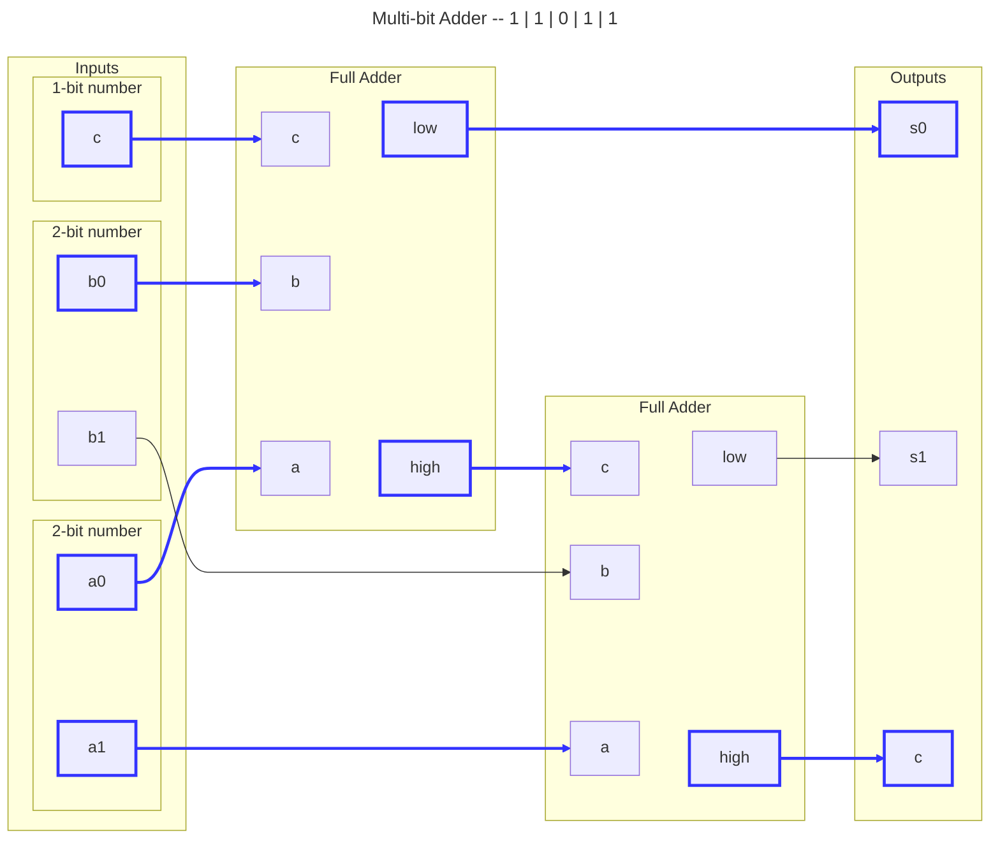
```mermaid
---
title: Multi-bit Adder -- 1 | 1 | 0 | 1 | 1
---
flowchart LR;

subgraph fa1 [Full Adder];
  direction LR;
  fa1ina[a] & fa1inb[b] & fa1inc[c] ~~~ fa1oh[high] & fa1ol[low];
end;

subgraph fa2 [Full Adder];
  direction LR;
  fa2ina[a] & fa2inb[b] & fa2inc[c] ~~~ fa2oh[high] & fa2ol[low];
end;

subgraph inputs [Inputs];
  direction TB;
  subgraph a# [2-bit number];
    a1[a1];
    a0[a0];
  end
  subgraph b# [2-bit number];
    b1[b1];
    b0[b0];
  end
  subgraph c# [1-bit number];
    c[c];
  end
end;

subgraph outputs [Outputs];
  direction TB;
  s0[s0]:::ON;
  s1[s1];
  co[c]:::ON;
end;

fa1ol:::ON;
fa1oh:::ON;
fa2oh:::ON;
a0:::ON --> fa1ina;
b0:::ON --> fa1inb;
c:::ON --> fa1inc;
a1:::ON --> fa2ina;
b1 --> fa2inb;
fa1oh --> fa2inc;
fa1ol ----> s0;
fa2ol --> s1;
fa2oh --> co[c];
classDef ON stroke:#33f,stroke-width:3px;
linkStyle 12 stroke:#33f,stroke-width:3px;
linkStyle 13 stroke:#33f,stroke-width:3px;
linkStyle 14 stroke:#33f,stroke-width:3px;
linkStyle 15 stroke:#33f,stroke-width:3px;
linkStyle 17 stroke:#33f,stroke-width:3px;
linkStyle 18 stroke:#33f,stroke-width:3px;
linkStyle 20 stroke:#33f,stroke-width:3px;
```

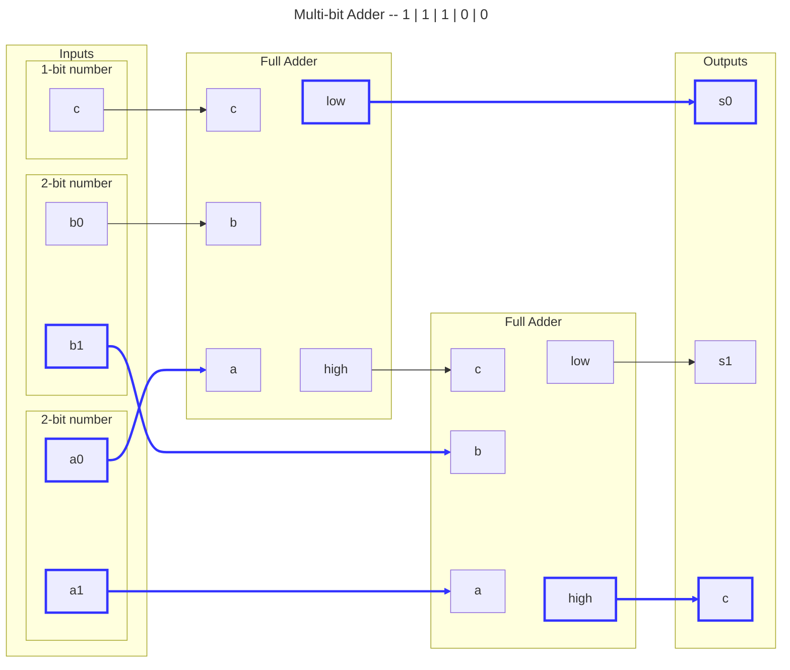
```mermaid
---
title: Multi-bit Adder -- 1 | 1 | 1 | 0 | 0
---
flowchart LR;

subgraph fa1 [Full Adder];
  direction LR;
  fa1ina[a] & fa1inb[b] & fa1inc[c] ~~~ fa1oh[high] & fa1ol[low];
end;

subgraph fa2 [Full Adder];
  direction LR;
  fa2ina[a] & fa2inb[b] & fa2inc[c] ~~~ fa2oh[high] & fa2ol[low];
end;

subgraph inputs [Inputs];
  direction TB;
  subgraph a# [2-bit number];
    a1[a1];
    a0[a0];
  end
  subgraph b# [2-bit number];
    b1[b1];
    b0[b0];
  end
  subgraph c# [1-bit number];
    c[c];
  end
end;

subgraph outputs [Outputs];
  direction TB;
  s0[s0]:::ON;
  s1[s1];
  co[c]:::ON;
end;

fa1ol:::ON;
fa2oh:::ON;
a0:::ON --> fa1ina;
b0 --> fa1inb;
c --> fa1inc;
a1:::ON --> fa2ina;
b1:::ON --> fa2inb;
fa1oh --> fa2inc;
fa1ol ----> s0;
fa2ol --> s1;
fa2oh --> co[c];
classDef ON stroke:#33f,stroke-width:3px;
linkStyle 12 stroke:#33f,stroke-width:3px;
linkStyle 16 stroke:#33f,stroke-width:3px;
linkStyle 15 stroke:#33f,stroke-width:3px;
linkStyle 18 stroke:#33f,stroke-width:3px;
linkStyle 20 stroke:#33f,stroke-width:3px;
```

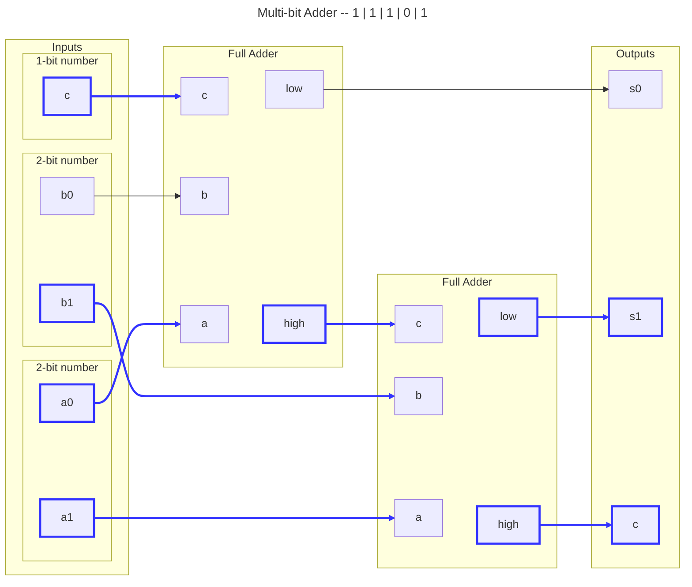
```mermaid
---
title: Multi-bit Adder -- 1 | 1 | 1 | 0 | 1
---
flowchart LR;

subgraph fa1 [Full Adder];
  direction LR;
  fa1ina[a] & fa1inb[b] & fa1inc[c] ~~~ fa1oh[high] & fa1ol[low];
end;

subgraph fa2 [Full Adder];
  direction LR;
  fa2ina[a] & fa2inb[b] & fa2inc[c] ~~~ fa2oh[high] & fa2ol[low];
end;

subgraph inputs [Inputs];
  direction TB;
  subgraph a# [2-bit number];
    a1[a1];
    a0[a0];
  end
  subgraph b# [2-bit number];
    b1[b1];
    b0[b0];
  end
  subgraph c# [1-bit number];
    c[c];
  end
end;

subgraph outputs [Outputs];
  direction TB;
  s0[s0];
  s1[s1]:::ON;
  co[c]:::ON;
end;

fa1oh:::ON;
fa2ol:::ON;
fa2oh:::ON;
a0:::ON --> fa1ina;
b0 --> fa1inb;
c:::ON --> fa1inc;
a1:::ON --> fa2ina;
b1:::ON --> fa2inb;
fa1oh --> fa2inc;
fa1ol ----> s0;
fa2ol --> s1;
fa2oh --> co[c];
classDef ON stroke:#33f,stroke-width:3px;
linkStyle 12 stroke:#33f,stroke-width:3px;
linkStyle 14 stroke:#33f,stroke-width:3px;
linkStyle 16 stroke:#33f,stroke-width:3px;
linkStyle 15 stroke:#33f,stroke-width:3px;
linkStyle 17 stroke:#33f,stroke-width:3px;
linkStyle 19 stroke:#33f,stroke-width:3px;
linkStyle 20 stroke:#33f,stroke-width:3px;
```

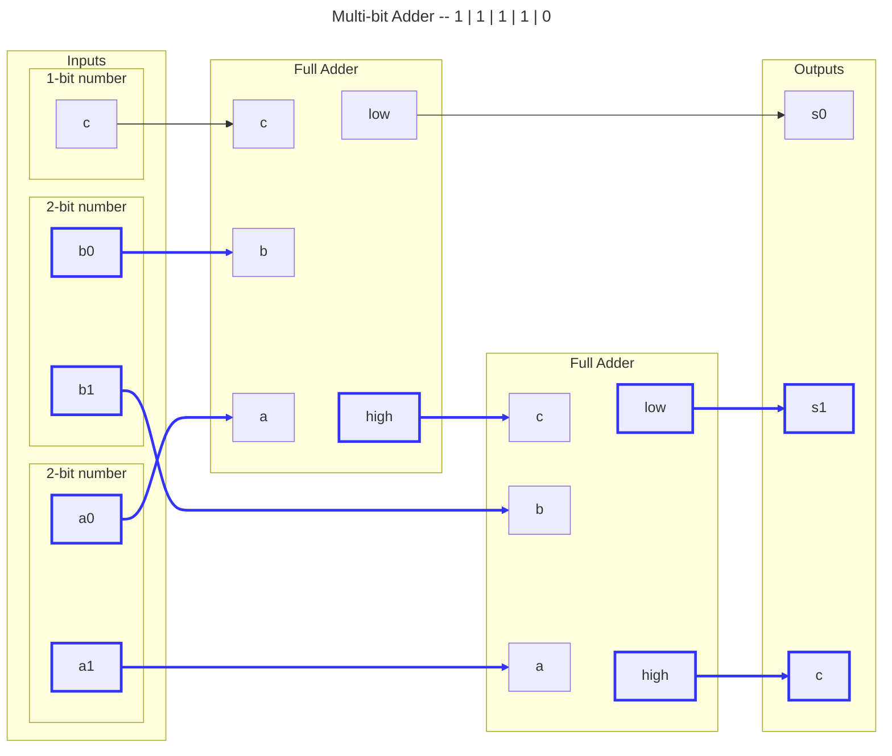
```mermaid
---
title: Multi-bit Adder -- 1 | 1 | 1 | 1 | 0
---
flowchart LR;

subgraph fa1 [Full Adder];
  direction LR;
  fa1ina[a] & fa1inb[b] & fa1inc[c] ~~~ fa1oh[high] & fa1ol[low];
end;

subgraph fa2 [Full Adder];
  direction LR;
  fa2ina[a] & fa2inb[b] & fa2inc[c] ~~~ fa2oh[high] & fa2ol[low];
end;

subgraph inputs [Inputs];
  direction TB;
  subgraph a# [2-bit number];
    a1[a1];
    a0[a0];
  end
  subgraph b# [2-bit number];
    b1[b1];
    b0[b0];
  end
  subgraph c# [1-bit number];
    c[c];
  end
end;

subgraph outputs [Outputs];
  direction TB;
  s0[s0];
  s1[s1]:::ON;
  co[c]:::ON;
end;

fa1oh:::ON;
fa2ol:::ON;
fa2oh:::ON;
a0:::ON --> fa1ina;
b0:::ON --> fa1inb;
c --> fa1inc;
a1:::ON --> fa2ina;
b1:::ON --> fa2inb;
fa1oh --> fa2inc;
fa1ol ----> s0;
fa2ol --> s1;
fa2oh --> co[c];
classDef ON stroke:#33f,stroke-width:3px;
linkStyle 12 stroke:#33f,stroke-width:3px;
linkStyle 13 stroke:#33f,stroke-width:3px;
linkStyle 16 stroke:#33f,stroke-width:3px;
linkStyle 15 stroke:#33f,stroke-width:3px;
linkStyle 17 stroke:#33f,stroke-width:3px;
linkStyle 19 stroke:#33f,stroke-width:3px;
linkStyle 20 stroke:#33f,stroke-width:3px;
```

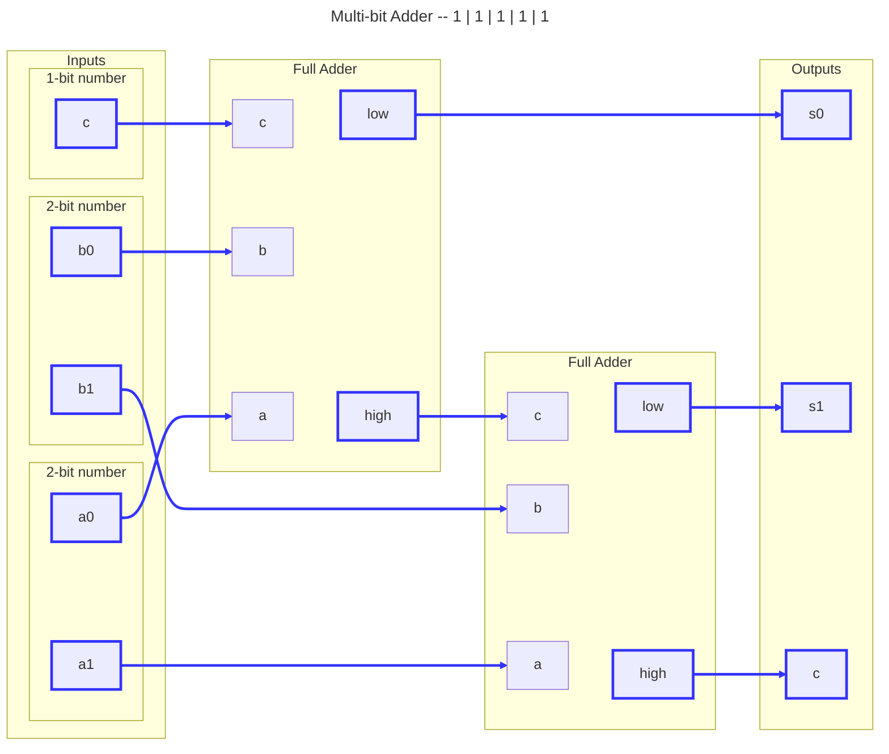
```mermaid
---
title: Multi-bit Adder -- 1 | 1 | 1 | 1 | 1
---
flowchart LR;

subgraph fa1 [Full Adder];
  direction LR;
  fa1ina[a] & fa1inb[b] & fa1inc[c] ~~~ fa1oh[high] & fa1ol[low];
end;

subgraph fa2 [Full Adder];
  direction LR;
  fa2ina[a] & fa2inb[b] & fa2inc[c] ~~~ fa2oh[high] & fa2ol[low];
end;

subgraph inputs [Inputs];
  direction TB;
  subgraph a# [2-bit number];
    a1[a1];
    a0[a0];
  end
  subgraph b# [2-bit number];
    b1[b1];
    b0[b0];
  end
  subgraph c# [1-bit number];
    c[c];
  end
end;

subgraph outputs [Outputs];
  direction TB;
  s0[s0]:::ON;
  s1[s1]:::ON;
  co[c]:::ON;
end;

fa1ol:::ON;
fa1oh:::ON;
fa2ol:::ON;
fa2oh:::ON;
a0:::ON --> fa1ina;
b0:::ON --> fa1inb;
c:::ON --> fa1inc;
a1:::ON --> fa2ina;
b1:::ON --> fa2inb;
fa1oh --> fa2inc;
fa1ol ----> s0;
fa2ol --> s1;
fa2oh --> co[c];
classDef ON stroke:#33f,stroke-width:3px;
linkStyle 12 stroke:#33f,stroke-width:3px;
linkStyle 13 stroke:#33f,stroke-width:3px;
linkStyle 14 stroke:#33f,stroke-width:3px;
linkStyle 16 stroke:#33f,stroke-width:3px;
linkStyle 15 stroke:#33f,stroke-width:3px;
linkStyle 17 stroke:#33f,stroke-width:3px;
linkStyle 18 stroke:#33f,stroke-width:3px;
linkStyle 19 stroke:#33f,stroke-width:3px;
linkStyle 20 stroke:#33f,stroke-width:3px;
```
