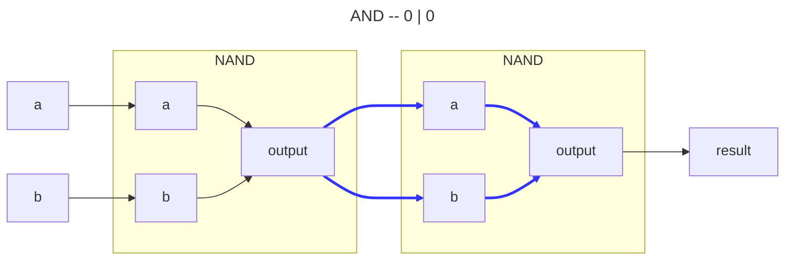
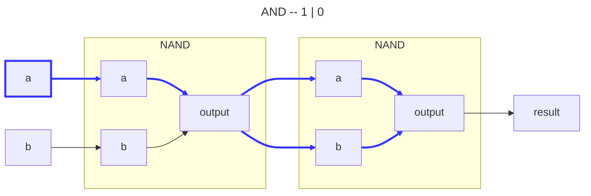
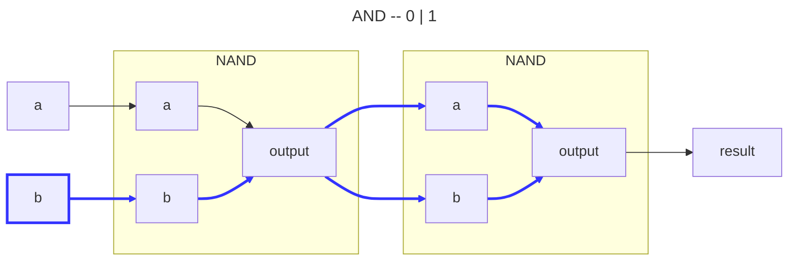
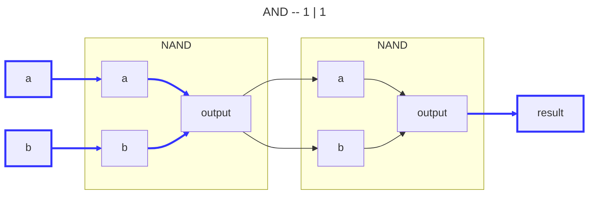
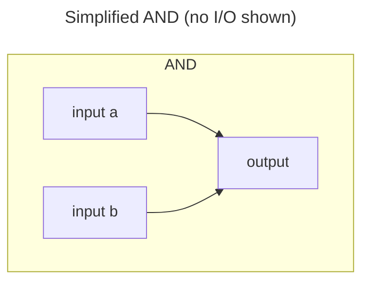

```mermaid
---
title: AND -- 0 | 0
---
flowchart LR;

subgraph n1 [NAND];
  direction LR;
  n1ina[a] & n1inb[b] --> n1o[output];
end;

subgraph n2 [NAND];
  direction LR;
  n2ina[a] & n2inb[b] --> n2o[output];
end;

a[a] --> n1ina;
b[b] --> n1inb;
n1o --> n2ina & n2inb;
n2o --> res[result];
linkStyle 2 stroke:#33f,stroke-width:3px;
linkStyle 3 stroke:#33f,stroke-width:3px;
linkStyle 6 stroke:#33f,stroke-width:3px;
linkStyle 7 stroke:#33f,stroke-width:3px;
```

```mermaid
---
title: AND -- 1 | 0
---
flowchart LR;

subgraph n1 [NAND];
  direction LR;
  n1ina[a] & n1inb[b] --> n1o[output];
end;

subgraph n2 [NAND];
  direction LR;
  n2ina[a] & n2inb[b] --> n2o[output];
end;

a[a]:::ON --> n1ina;
b[b] --> n1inb;
n1o --> n2ina & n2inb;
n2o --> res[result];
classDef ON stroke:#33f,stroke-width:3px;
linkStyle 0 stroke:#33f,stroke-width:3px;
linkStyle 2 stroke:#33f,stroke-width:3px;
linkStyle 3 stroke:#33f,stroke-width:3px;
linkStyle 4 stroke:#33f,stroke-width:3px;
linkStyle 6 stroke:#33f,stroke-width:3px;
linkStyle 7 stroke:#33f,stroke-width:3px;
```

```mermaid
---
title: AND -- 0 | 1
---
flowchart LR;

subgraph n1 [NAND];
  direction LR;
  n1ina[a] & n1inb[b] --> n1o[output];
end;

subgraph n2 [NAND];
  direction LR;
  n2ina[a] & n2inb[b] --> n2o[output];
end;

a[a] --> n1ina;
b[b]:::ON --> n1inb;
n1o --> n2ina & n2inb;
n2o --> res[result];
classDef ON stroke:#33f,stroke-width:3px;
linkStyle 1 stroke:#33f,stroke-width:3px;
linkStyle 2 stroke:#33f,stroke-width:3px;
linkStyle 3 stroke:#33f,stroke-width:3px;
linkStyle 5 stroke:#33f,stroke-width:3px;
linkStyle 6 stroke:#33f,stroke-width:3px;
linkStyle 7 stroke:#33f,stroke-width:3px;
```

```mermaid
---
title: AND -- 1 | 1
---
flowchart LR;

subgraph n1 [NAND];
  direction LR;
  n1ina[a] & n1inb[b] --> n1o[output];
end;

subgraph n2 [NAND];
  direction LR;
  n2ina[a] & n2inb[b] --> n2o[output];
end;

a[a]:::ON --> n1ina;
b[b]:::ON --> n1inb;
n1o --> n2ina & n2inb;
n2o --> res[result]:::ON;
classDef ON stroke:#33f,stroke-width:3px;
linkStyle 0 stroke:#33f,stroke-width:3px;
linkStyle 1 stroke:#33f,stroke-width:3px;
linkStyle 4 stroke:#33f,stroke-width:3px;
linkStyle 5 stroke:#33f,stroke-width:3px;
linkStyle 8 stroke:#33f,stroke-width:3px;
```

---

```mermaid
---
title: Simplified AND (no I/O shown)
---
flowchart LR;

subgraph AND;
  direction LR;
  a1i[input a] & a2i[input b] --> a1o[output];
end;
```
