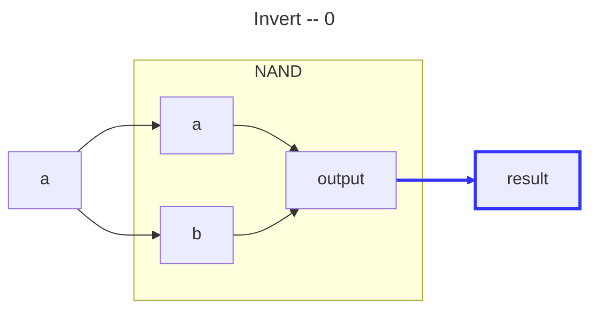
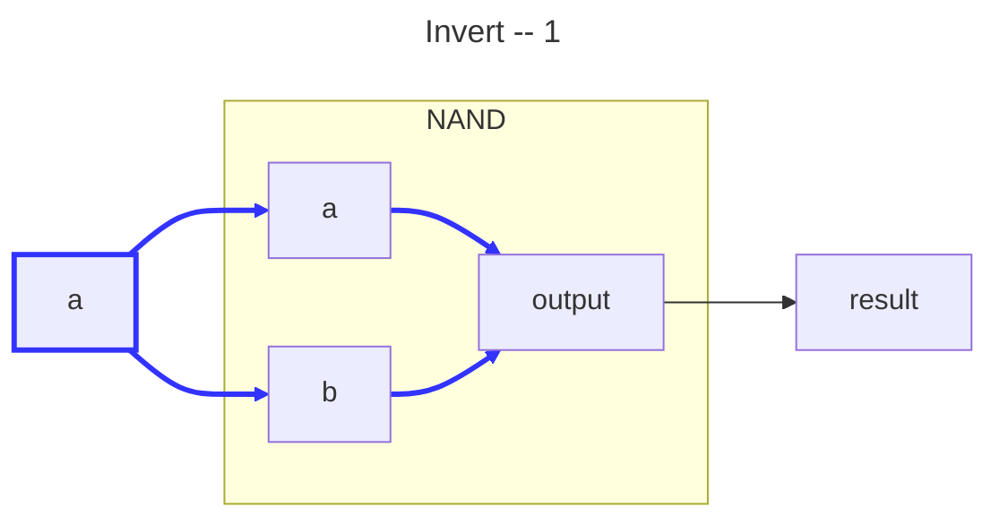

```mermaid
---
title: Invert -- 0
---
flowchart LR;

subgraph n1 [NAND];
  n1ina[a] & n1inb[b] --> n1o[output];
end;

a[a] --> n1ina & n1inb;
n1o --> res[result]:::ON;
classDef ON stroke:#33f,stroke-width:3px;
linkStyle 4 stroke:#33f,stroke-width:3px;
```

```mermaid
---
title: Invert -- 1
---
flowchart LR;

subgraph n1 [NAND];
  n1ina[a] & n1inb[b] --> n1o[output];
end;

a[a]:::ON --> n1ina & n1inb;
n1o --> res[result];
classDef ON stroke:#33f,stroke-width:3px;
linkStyle 0 stroke:#33f,stroke-width:3px;
linkStyle 1 stroke:#33f,stroke-width:3px;
linkStyle 2 stroke:#33f,stroke-width:3px;
linkStyle 3 stroke:#33f,stroke-width:3px;
```
