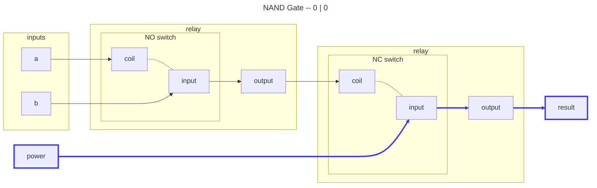
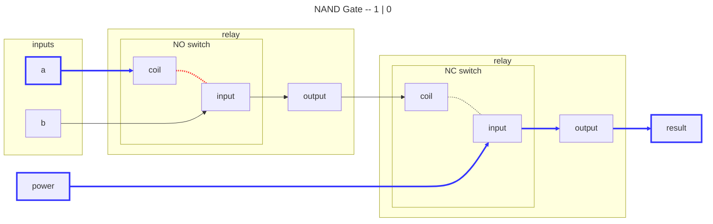
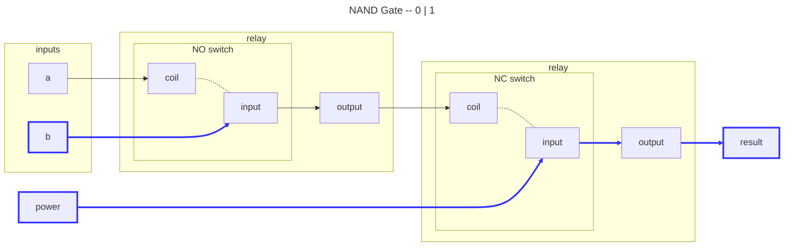
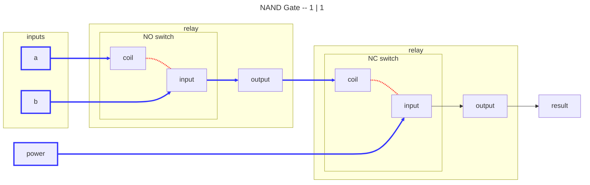
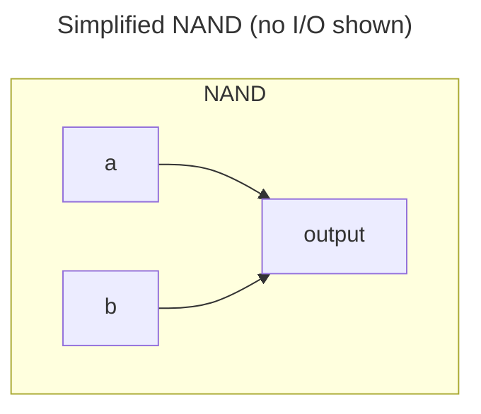

```mermaid
---
title: NAND Gate -- 0 | 0
---
flowchart LR;

subgraph r1 [relay];
  subgraph s1 [NO switch];
    r1c[coil]-.-r1in[input];
  end
r1in-->r1out[output];
end;

subgraph inputs;
  a[a]-->r1c;
  b[b]-->r1in;
end;

subgraph r2 [relay];
  subgraph s2 [NC switch];
    r2c[coil]-.-r2in[input];
  end
r2in-->r2out[output];
end;

v[power]:::ON------>r2in;
r1out-->r2c;
r2out-->res[result]:::ON;
classDef ON stroke:#33f,stroke-width:3px;
linkStyle 8 stroke:#33f,stroke-width:3px;
linkStyle 5 stroke:#33f,stroke-width:3px;
linkStyle 6 stroke:#33f,stroke-width:3px;
```

```mermaid
---
title: NAND Gate -- 1 | 0
---
flowchart LR;

subgraph r1 [relay];
  subgraph s1 [NO switch];
    r1c[coil]-.-r1in[input];
  end
r1in-->r1out[output];
end;

subgraph inputs;
  a[a]:::ON-->r1c;
  b[b]-->r1in;
end;

subgraph r2 [relay];
  subgraph s2 [NC switch];
    r2c[coil]-.-r2in[input];
  end
r2in-->r2out[output];
end;

v[power]:::ON------>r2in;
r1out-->r2c;
r2out-->res[result]:::ON;
classDef ON stroke:#33f,stroke-width:3px;
linkStyle 0 stroke:#f33,stroke-width:3px;
linkStyle 2 stroke:#33f,stroke-width:3px;
linkStyle 5 stroke:#33f,stroke-width:3px;
linkStyle 6 stroke:#33f,stroke-width:3px;
linkStyle 8 stroke:#33f,stroke-width:3px;
```

```mermaid
---
title: NAND Gate -- 0 | 1
---
flowchart LR;

subgraph r1 [relay];
  subgraph s1 [NO switch];
    r1c[coil]-.-r1in[input];
  end
r1in-->r1out[output];
end;

subgraph inputs;
  a[a]-->r1c;
  b[b]:::ON-->r1in;
end;

subgraph r2 [relay];
  subgraph s2 [NC switch];
    r2c[coil]-.-r2in[input];
  end
r2in-->r2out[output];
end;

v[power]:::ON------>r2in;
r1out-->r2c;
r2out-->res[result]:::ON;
classDef ON stroke:#33f,stroke-width:3px;
linkStyle 3 stroke:#33f,stroke-width:3px;
linkStyle 5 stroke:#33f,stroke-width:3px;
linkStyle 6 stroke:#33f,stroke-width:3px;
linkStyle 8 stroke:#33f,stroke-width:3px;
```

```mermaid
---
title: NAND Gate -- 1 | 1
---
flowchart LR;

subgraph r1 [relay];
  subgraph s1 [NO switch];
    r1c[coil]-.-r1in[input];
  end
r1in-->r1out[output];
end;

subgraph inputs;
  a[a]:::ON-->r1c;
  b[b]:::ON-->r1in;
end;

subgraph r2 [relay];
  subgraph s2 [NC switch];
    r2c[coil]-.-r2in[input];
  end
r2in-->r2out[output];
end;

v[power]:::ON------>r2in;
r1out-->r2c;
r2out-->res[result];
classDef ON stroke:#33f,stroke-width:3px;
linkStyle 0 stroke:#f33,stroke-width:3px;
linkStyle 1 stroke:#33f,stroke-width:3px;
linkStyle 2 stroke:#33f,stroke-width:3px;
linkStyle 3 stroke:#33f,stroke-width:3px;
linkStyle 4 stroke:#f33,stroke-width:3px;
linkStyle 6 stroke:#33f,stroke-width:3px;
linkStyle 7 stroke:#33f,stroke-width:3px;
```

```mermaid
---
title: Simplified NAND (no I/O shown)
---
flowchart LR;

subgraph "NAND";
  direction LR;
  n1ina[a] & n1inb[b] --> n1o[output];
end;
```
