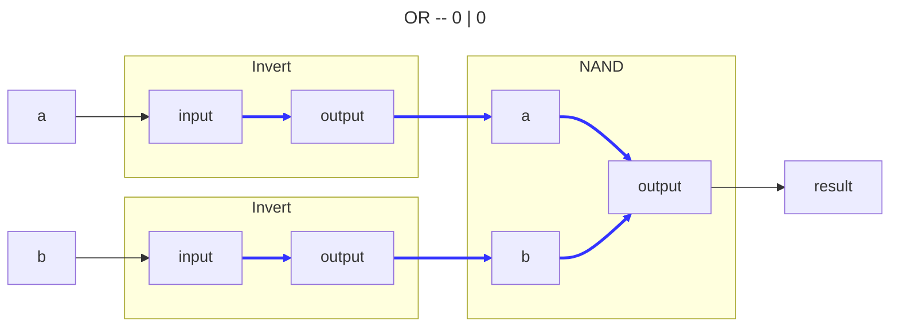
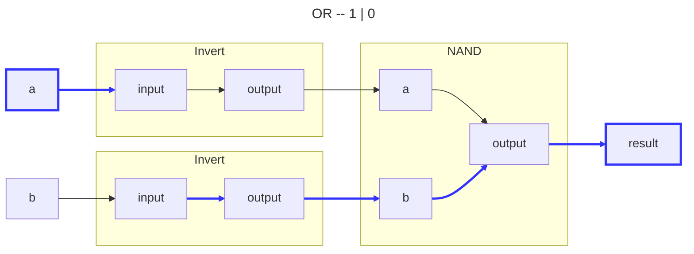
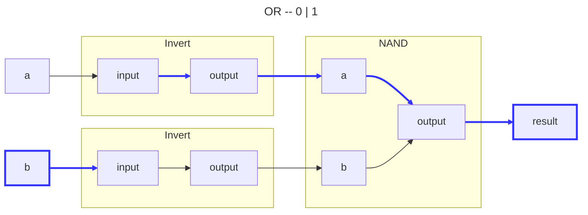
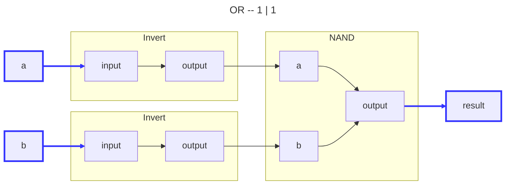
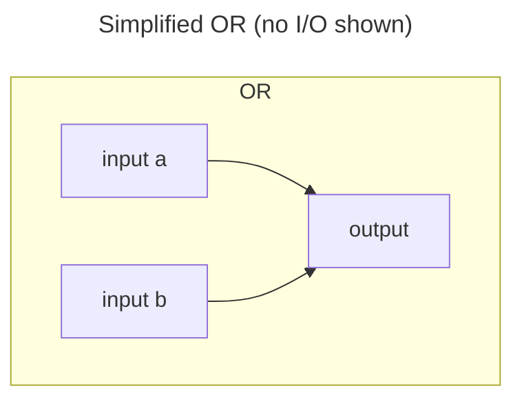

# OR Gate

## Logic

|Input A|Input B|Output|
|:-----:|:-----:|:----:|
|      0|      0|     0|
|      1|      0|     1|
|      0|      1|     1|
|      1|      1|     1|

## Usage

High output if at least one input is high.

---

---

